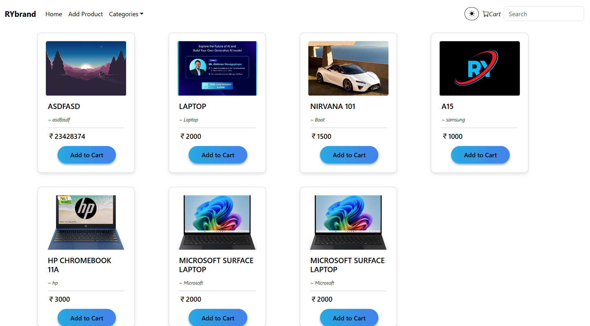
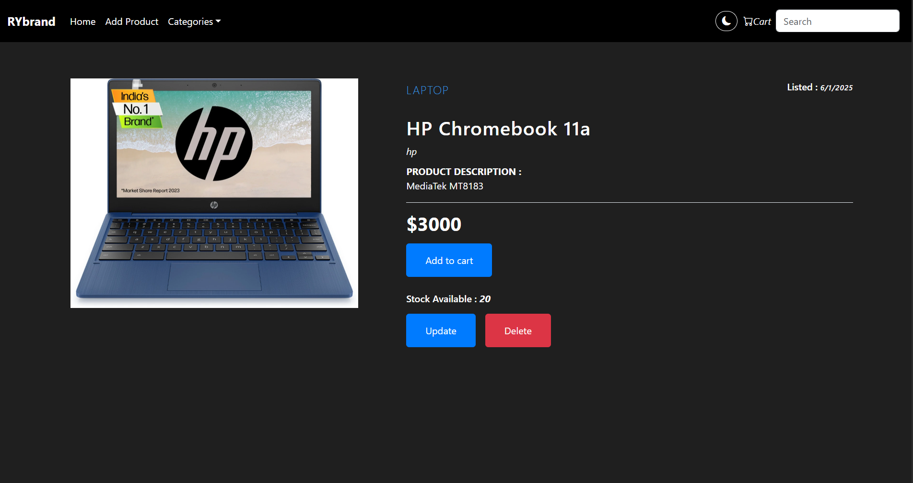
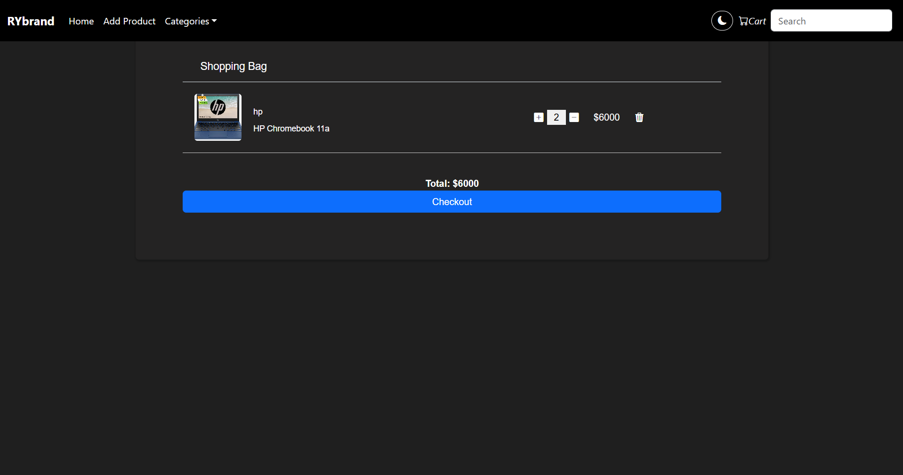

# 🛒 E-commerce Website — Frontend

> A dynamic and responsive E-commerce frontend built using **React**, **Bootstrap 5**, and connected to a **Spring Boot** REST API backend.

---

## 🌐 Live Demo

🔗 [Live Site](https://ecommerce-ry-frontend.vercel.app/)

---

## 📸 Screenshots

  
  


---

## ⚙️ Features

- 🏬 Browse all products  
- 🔍 Search and filter products  
- ➕ Add to cart  
- 🛒 Manage shopping cart items  
- 🧾 Checkout (with placeholder logic or integrated backend)  
- 📤 Upload product with image (admin)  
- 🚦 Update product availability  
- 📱 Fully responsive layout  

---

## 🔧 Tech Stack

**Frontend:**  
- React  
- Axios  
- Bootstrap 5  
- React Router

**Backend:**  
- Spring Boot (REST API)

**Deployment:**  
- Frontend: [Vercel](https://vercel.com/)  
- Backend: [Railway](https://railway.app/)

**Database:**  
- MySQL (hosted on Railway)

---

## 🚀 How to Run Locally

```bash
git clone https://github.com/your-username/ecommerce-frontend.git
cd ecommerce-frontend
npm install
npm start
